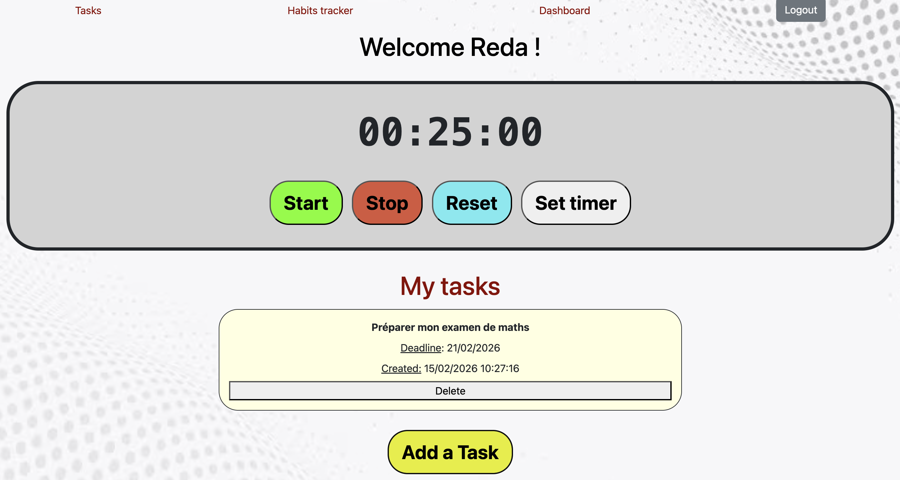

# 📘 To Do App

Ceci est un projet personnel. Il s'agit d'une application ayant pour but d'aider les utilisateurs à être
plus productifs.

---

## 🚀 Fonctionnalités

- Un système d'authentification des utilisateurs.
- Un timer pour chronométrer les heures de travail.
- Un dashboard affichant le nombre de minutes travaillées par l'utilisateur durant les 7 derniers jours.
- L'ajout et la suppression des tâches à faire en affichant leurs deadlines et leurs dates de création.
- L'ajout et la suppression d'habitudes à suivre en affichant leurs nombres de streaks et leurs dates de création.

---

## Interface
<p align="center">
  
</p>

---

## 🛠️ Technologies utilisées

- Backend : Python avec le framework Flask
- Frontend : HTML, CSS, JavaScript, Jinja2, Bootstrap
- Base de données : SQLite

---

## ⚙️ Installation et lancement

1. Cloner le dépôt :
```bash
git clone https://github.com/yaoureda/To-Do-App.git
cd To-Do-App
```

2. Créer et activer un environnement virtuel à partir du terminal :
**Sur Windows (Command Prompt):**
```cmd
python -m venv venv
venv\Scripts\activate.bat
```

**Sur Windows (PowerShell):**
```powershell
python -m venv venv
venv\Scripts\Activate.ps1
```

**Sur macOS/Linux:**
```bash
python3 -m venv venv
source venv/bin/activate
```

> Cela crée un dossier nommé `venv` dans le répertoire du projet.

3. Installer les dépendances et lancer l'application :
```bash
pip install -r requirements.txt
python run.py
```

> L'application sera lancée sur: **http://localhost:5000**

---

## 🌐 Démo en ligne

Le site est disponible ici : [To-Do-App](https://to-do-app-y7i6.onrender.com)

Vous pouvez naviguer entre les pages :
- Tasks (incluant un timer et les tâches à faire)
- Habits Tracker
- Dashbord (des minutes travaillées durant les 7 derniers jours)

⚠️ Le site est hébergé sur Render (free tier) : il peut mettre jusqu’à 1 minute à démarrer après une période d’inactivité.

---

## 🧾 Améliorations possibles

- Garder l'historique des tâches complétées.
- La possibilité d'afficher les dashboards des semaines précédentes.

---

## 📁 Structure du projet

```
todoapp/
├── README.md
├── app
│   ├── __init__.py
│   ├── api
│   │   ├── __init__.py
│   │   ├── config.py
│   │   ├── habits_routes.py
│   │   ├── tasks_routes.py
│   │   ├── users_routes.py
│   │   └── workSeesions_routes.py
│   ├── database
│   │   ├── __init__.py
│   │   ├── database.db
│   │   ├── database.py
│   │   └── models.py
│   ├── static
│   │   ├── css
│   │   ├── images
│   │   └── js
│   ├── templates
│   │   ├── base.html
│   │   ├── baseA.html
│   │   ├── dashboard.html
│   │   ├── habits.html
│   │   ├── index.html
│   │   ├── login.html
│   │   ├── signup.html
│   │   └── tasks.html
│   └── web
│       ├── __init__.py
│       ├── config.py
│       ├── dashboard_routes.py
│       ├── habits_routes.py
│       ├── index_routes.py
│       ├── login_routes.py
│       ├── logout_routes.py
│       ├── signup_routes.py
│       └── tasks_routes.py
├── requirements.txt
└── run.py
```

